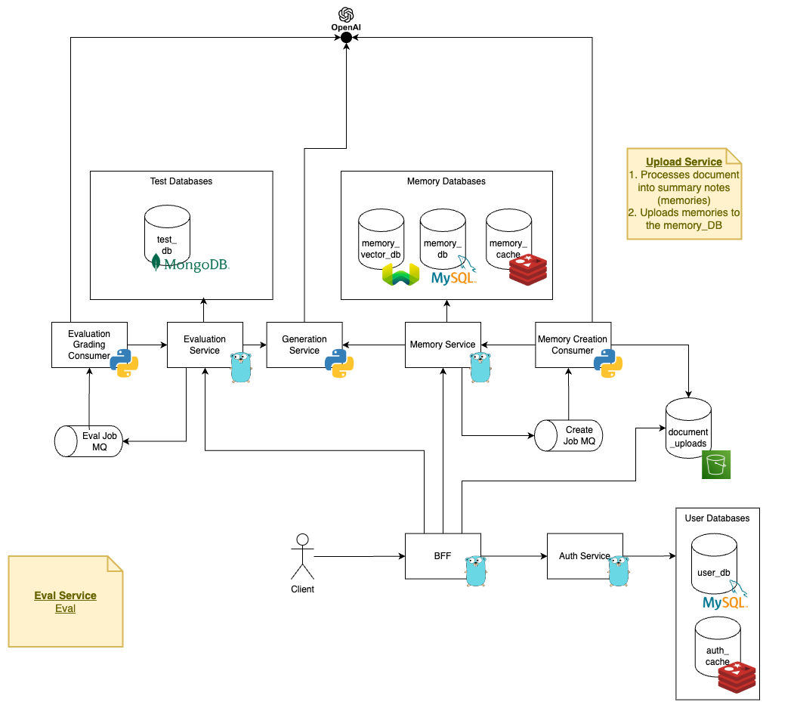
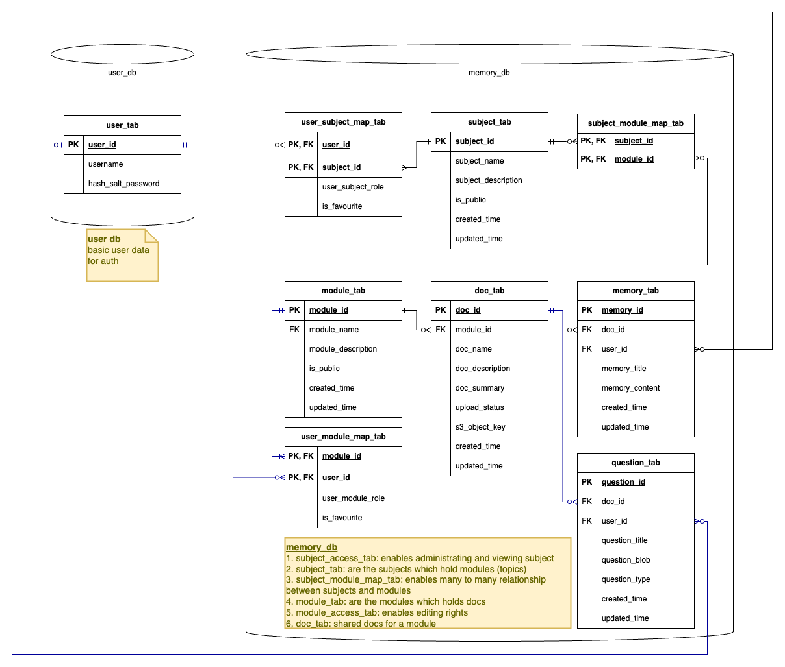

# Readme.md

## 1. Description

LLM app for learning
Capabilities:

1. Send files to server to process and store embedded knowledge in a vector database
2. Generate FlashCards from the stored knowledge
3. Generate Quiz from the stored knowledge
4. Score the user based on the quiz
5. Generate a summary of the stored knowledge
6. Retrieval Augmented Generation to query the stored knowledge
7. Login and registration for different users
8. Modules may be shared between subjects
9. Able to give read/write access to other users
10. Generate a report of the user's progress
11. Generate a report of the user's performance

## 2. Architecture

## 3. DB Design

