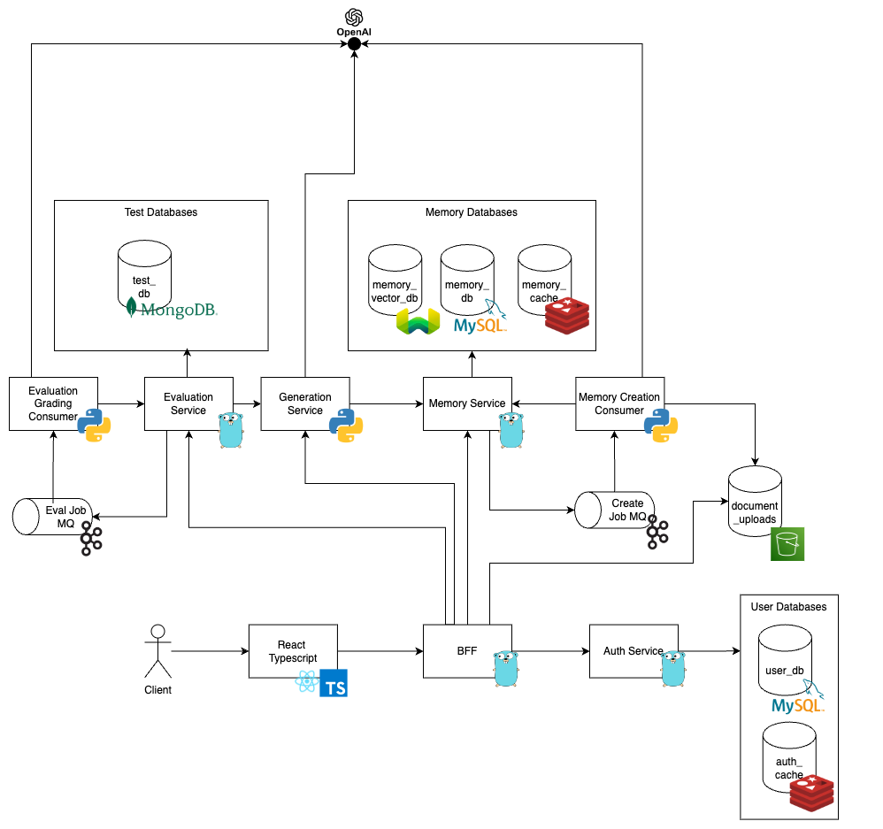

# Readme.md

## 1. Setup

1. Have docker installed and replace the placeholders in docker-compose.yml
2. Run the following command: 'make run'

## 2. Description

Tutor AI is a web application that allows users to store knowledge in a vector database and generate FlashCards, Quizzes, Memory chunks, and Summaries from the stored knowledge. Documents are uploaded to module objects that can be shared amongst subjects.
Subject-Module-Document Relationship:

Capabilities:

1. Send files to server to process and store embedded knowledge in a vector database [done]
2. Generate FlashCards from the stored knowledge [done]
3. Generate Quiz from the stored knowledge [done]
4. Score the user based on the quiz [to-do]
5. Generate a summary of the stored knowledge [done]
6. Retrieval Augmented Generation to query the stored knowledge [done]
7. Login and registration for different users [done]
8. Modules may be shared between subjects [done]
9. Able to give read/write access to other users [to-do]
10. Generate a report of the user's progress [to-do]
11. Generate a report of the user's performance [to-do]

Technologies used:

1. GoLang
    a. Gin
    b. GRPC
    c. Confluent Kafka Producer
2. React
    a. Typescript
    b. Typescript
    c. Axios
3. Python
    a. GRPC
    b. Confluent Kafka Consumer
4. MySQL
5. Kafka
6. Weaviate
7. Docker
8. Redis

## 3. Architecture

### 3.1. Frontend

React Typescript is used to create the frontend. The frontend communicates with the backend using REST APIs. The frontend is responsible for sending files to the backend, displaying the generated FlashCards, Quizzes, and Summaries. The frontend also allows the user to interact with the generated FlashCards and Quizzes.

### 3.2. Backend

#### 3.2.1. BFF (GoLang)

Ingress: Gin REST API
Egress: GRPC

The Backend for Frontend is written in GoLang. The BFF is for routing requests from the frontend to the appropriate service. Eg authentication, file upload, and document processing.

#### 3.2.2. Authentication (GoLang)

Ingress: GRPC
Egress: GRPC

The authentication service is in charge of creating users, sessions and deleting sessions. The service communicates with the MySQL database to store user information and the Redis database to store session information.

#### 3.2.3. Memory Creation Consumer (Python)

Ingress: Kafka Event
Egress: GRPC

The Memory Creation Consumer is written in Python. The consumer listens to events from Kafka for documents to be processed. The consumer processes the document and stores the knowledge, summary, memory chunks, quizzes, and flashcards in the database by querying the openai API.

#### 3.2.4. Generation Service (Python)

Ingress: GRPC
Egress: GRPC

The Generation Service is in charge of general chat features such as RAG question and answering based on context. THe service communicates with memory service to fetch the knowledge to contextualise the question.

#### 3.2.5. Memory Service (GoLang)

Ingress: GRPC
Egress: GRPC

The Memory Service is in charge of storing and retrieving knowledge, summaries, memory chunks, quizzes, and flashcards. The service communicates with the MySQL database to store and retrieve the information.

#### 3.2.6. Evaluation Service (Golang)

Ingress: GRPC
Egress: GRPC

The Evaluation Service is in charge of historical test results and user performance. The service communicates with the MySQL database to store and retrieve the information.

#### 3.2.7. Evaluation Grading Consumer (Python)

Ingress: Kafka Event
Egress: GRPC

The Evaluation Grading Consumer is written in Python. The consumer listens to events from Kafka for tests to be graded and queries the openai API to grade the test.

### 3.3. Database

#### 3.3.1. MySQL Auth

The MySQL database is used to store user information such as username and salted hashed password.

#### 3.3.2. MySQL Memory

The MySQL database is used to store knowledge, summaries, memory chunks, quizzes, and flashcards.

#### 3.3.3. Redis

Redis cache are used to store session information and cache frequently accessed data.

#### 3.3.4. Weaviate

Weaviate is used to store the knowledge in a vector database. Capable of embedding documents using openAI module and querying the knowledge. Prefilter capabilities are used to filter the knowledge based on the user's query.

### 3.4. MQ

#### 3.4.1. Kafka

Used to decouple the services and allow for asynchronous processing of events such as document processing and test grading.

## 4. DB Design

